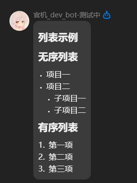
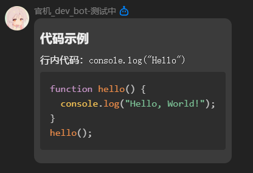
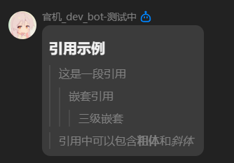
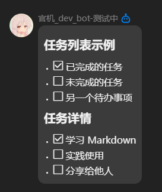
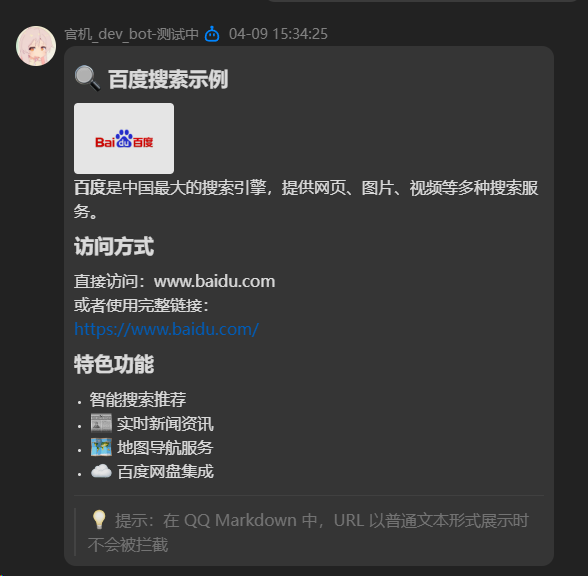
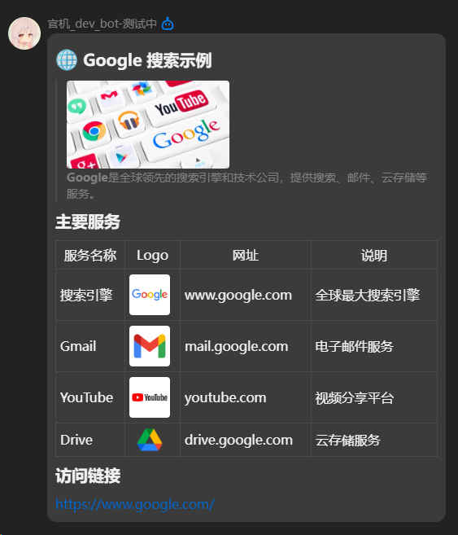
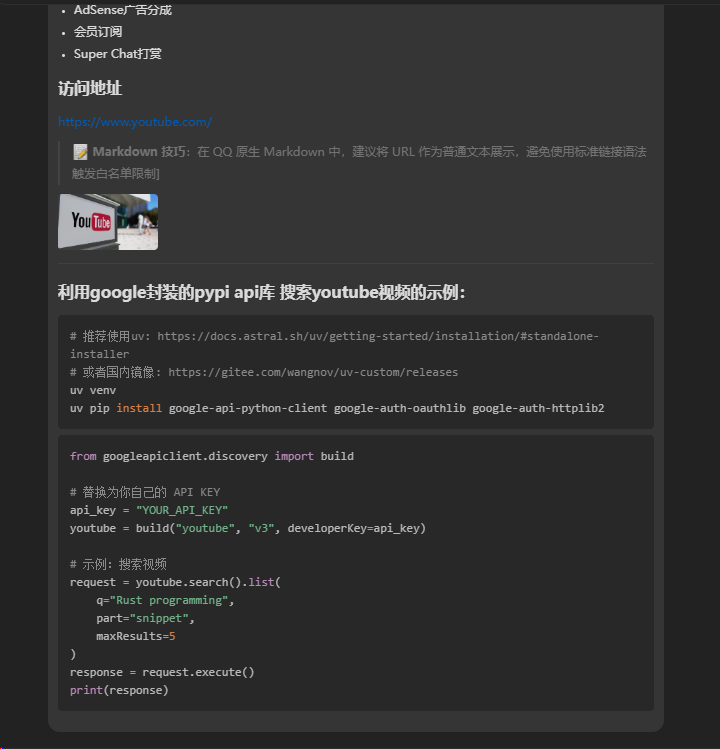

# koishi-plugin-md-tryer

[](https://www.npmjs.com/package/koishi-plugin-md-tryer)
[](https://www.npmjs.com/package/koishi-plugin-md-tryer)
[](https://forum.koishi.xyz/t/topic/12432)

用于测试和调试 QQ 平台原生 Markdown 消息的 Koishi 插件。

## 功能特性

- 发送原生 Markdown 格式消息
- 提供 10 个预置的 Markdown 示例
- 支持发送原始文本模式
- 支持调试模式，在 console 打印发送的内容

## 安装

```bash
# 在 Koishi 插件市场搜索 md-tryer 安装
# 或使用命令行安装
yarn add koishi-plugin-md-tryer
```

## 配置

在 Koishi 配置文件中添加：

```yaml
plugins:
  md-tryer:
    verboseConsoleInfo: false  # 是否开启调试模式，打印发送的 Markdown 内容
```

## 使用方法

### 发送自定义 Markdown

```bash
echo-md # 标题\n**粗体**文本
```

### 发送预置示例

```bash
# 使用完整参数名
echo-md --example 0

# 使用简写
echo-md -e 5
```

### 发送原始文本

```bash
echo-md --raw "这是原始文本"
echo-md -e 2 --raw
```

## 预置示例

插件提供了 10 个预置的 Markdown 示例，涵盖各种常用格式：

| 索引 | 示例名称 | 说明 |
|------|---------|------|
| 0 | 标题示例 | 展示各级标题和文本格式 |
| 1 | 列表示例 | 展示无序列表和有序列表 |
| 2 | 文本格式示例 | 展示粗体、斜体、删除线等 |
| 3 | 代码示例 | 展示行内代码和代码块 |
| 4 | 引用示例 | 展示多级嵌套引用 |
| 5 | 表格示例 | 展示 Markdown 表格 |
| 6 | 分割线和强调示例 | 展示分割线和文本强调 |
| 7 | 任务列表示例 | 展示任务列表格式 |
| 8 | 混合格式示例 | 展示多种格式的组合 |
| 9 | 高级示例 | 展示数学公式和代码高亮 |

## 示例展示

### 示例 0 - 标题示例


### 示例 1 - 列表示例



### 示例 2 - 文本格式示例


### 示例 3 - 代码示例



### 示例 4 - 引用示例



### 示例 5 - 表格示例


### 示例 6 - 分割线和强调示例


### 示例 7 - 任务列表示例



### 示例 8 - 混合格式示例


### 示例 9 - 高级示例


### 示例 10 - 单图示例（mihoyo）


### 示例 11 - 百度搜索示例



### 示例 12 - Google 搜索示例



### 示例 13 - Bilibili 哔哩哔哩示例


### 示例 14 - YouTube 示例




### 示例 15 - 原神：提瓦特大陆的冒险


## 核心代码段

本插件的核心是通过调用 QQ Bot API 的原生 Markdown 接口来发送消息：

```typescript
await session.bot.internal.sendMessage(session.channelId, {
  msg_id: session.messageId,
  msg_type: 2,
  markdown: {
    content,
  },
})
```

关键参数说明：
- `msg_type: 2` - 指定消息类型为 Markdown
- `markdown.content` - Markdown 格式的文本内容
- `msg_id` - 关联的消息ID，用于引用回复

## 源码

- [查看示例markdown源码](src/markdown-example.ts)
- [上游GitHub仓库](https://github.com/IsHPDuwu/koishi-plugin-md-tryer)

## 注意事项

- 此插件仅支持 QQ 平台的原生 Markdown 消息
- 需要确保已开通 QQ 机器人的原生 Markdown 权限
- 某些特殊格式可能因平台限制而无法正常显示

### 内容审查

QQ 平台会对发送的内容进行审查，包含不合规内容的消息会被拒绝发送。常见错误示例：

```json
[E] echo-md 发送失败: HTTPError: Bad Request
{ response: { 
  data: { 
    message: '请求参数不允许包含url www.example.com', 
    code: 40034028, 
    err_code: 40034028 
  }, 
  status: 400 
}}
```

**常见被拦截的内容：**
- 包含特定域名的链接（如 `www.example.com`）
- 敏感关键词
- 违规图片链接

**建议：**
- 开启 `verboseConsoleInfo` 配置项，在 console 查看实际发送的内容
- 如果遇到发送失败，尝试修改文案或移除可疑内容
- 使用 `--raw` 参数测试原始文本是否能正常发送

### 链接语法说明 ⚠️

QQ 原生 Markdown 对链接的处理有特殊规则：

#### ✅ 安全的方式（不触发白名单检测）

1. **普通文本中的 URL** - 直接写 URL，不会被识别为链接
   ```markdown
   访问 www.baidu.com 获取更多信息
   ```

2. **使用尖括号包裹** - 在某些上下文中会保留尖括号作为普通文本
   ```markdown
   <www.baidu.com>
   ```
   
   > 💡 注意：在标题、引用等结构中，`<URL>` 通常会被当作普通文本处理，不会自动转换为可点击的链接。
   
   **普通文本中的链接示例：**
   
   

#### ❌ 会触发白名单检测的方式

使用标准 Markdown 链接语法时，QQ 会**强制检测 URL 白名单**：

```markdown
  <!-- 需要域名在白名单中 -->
```

如果域名不在白名单中，会返回错误：
```json
{ 
  "message": "请求参数不允许包含url www.example.com", 
  "code": 40034028 
}
```

#### 🔧 解决方案

如果需要发送外部链接：
1. 联系 QQ 开放平台申请域名白名单
2. 或者只使用普通文本形式展示 URL，让用户手动复制
3. 使用短链接服务将长域名转为已备案的短域名


