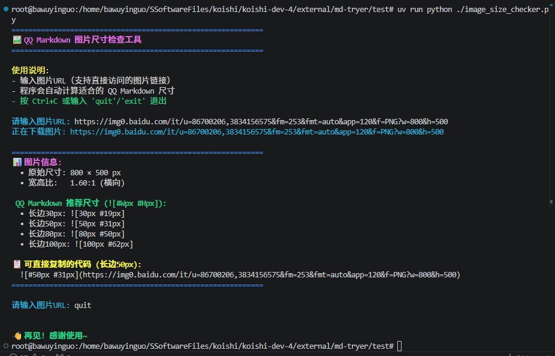

## 🛠️ (可选)如何使用这个py脚本

> 并不要求强制使用这个脚本，只是一个按需的小工具捏！如果你想在发送图片时保持完美的宽高比，又不想手动敲计算器，可以用它来自动生成最合适的 Markdown 尺寸代码。


```bash
cd test
# 推荐使用 uv (更快更稳):
# https://docs.astral.sh/uv/getting-started/installation/
# 或者使用 gitee 镜像安装:
# https://gitee.com/wangnov/uv-custom/releases
uv venv
uv pip install Pillow
uv run python ./image_size_checker.py
# 然后直接粘贴图片 URL 就可以啦！比如：
# https://bkimg.cdn.bcebos.com/pic/d043ad4bd11373f08202441b13595cfbfbedaa64aea3?x-bce-process=image/format,f_auto/quality,Q_70/resize,m_lfit,limit_1,w_536
```

## 📸 使用示例



> 💡 **提示**：工具会自动计算宽高比，并提供多种推荐尺寸（长边 30px/50px/80px/100px），方便你根据 QQ Markdown 的显示需求选择最合适的代码。

> 💡 **提示2**: 制作这个脚本并不是为了鼓励在 Koishi 项目里搞“多语言混合”，而是想小小地安利一下：在开发、运维或者单纯折腾的时候，掌握一门顺手的脚本语言真的能让生活质量起飞捏！Python当然算脚本语言啦，而且相当好用捏~

> 💡 **提示3**: 虽然最初想过用 PowerShell 或 Bash 来写，但既然追求跨平台和开发效率，Python 显然是更优雅的选择。希望这个小脚本能帮你省下敲计算器的时间，让你更专注于更有趣的代码逻辑～